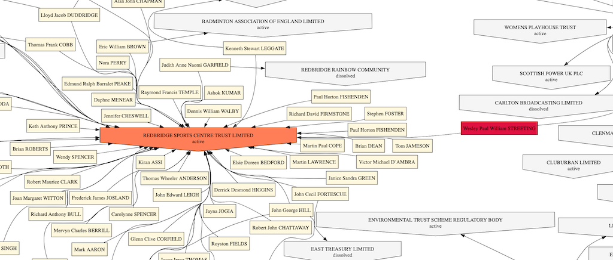

# Companies House Relationship Grapher

A tool that graphs the relationships between companies and people using the Companies House API.

### Example:



See the full rendered graph here: [Rendered Graph](examples/WesleyPaulWilliamSTREETING.gv.svg)

## Installation

First install Graphviz:

This depends on your OS

- Ubuntu: `sudo apt-get install graphviz`
- MacOS: `brew install graphviz`
- Windows: [Download the installer](https://graphviz.org/download/)

Then install the Python dependencies in a venv or equivalent (google this if you don't know how):

```bash
pip install -r requirements.txt
```

### Companies House API Key

You'll need a companies house api key. You can get this by registering an application with Companies House in their developer portal

See: https://developer.company-information.service.gov.uk/get-started

## Usage

```bash
python ch_parser.py 
    -u URL  # The URL of the base officer you're looking at - e.g https://find-and-update.company-information.service.gov.uk/officers/zvMsdSrp3DBpbynbh7l5mg9MlPI/appointments
    -k APIKEY # a Companies House API key
    [-d DETECT] # Detect service companies with large numbers of links - 'true' or 'false' (default faulse)
    [-n NUMBER] # The number of links to detect a service company - default 250
```

Files will be in the /output directory 